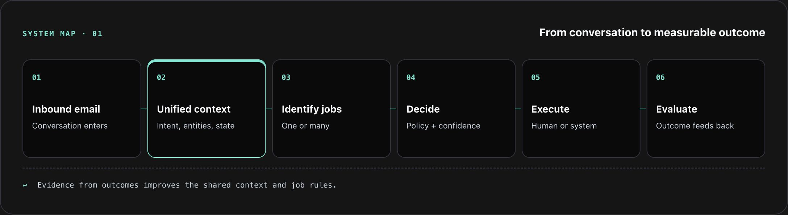

# AI Native Email System

A job-based system being built around Sock Club’s sales inbox, with a live human-reviewed design-request workflow and a universal router operating in shadow mode.

## Metadata

| Field | Value |
| --- | --- |
| Documentation status | Documentation draft |
| Project status | In progress as reported in the August 27, 2026 build journal; Portal+ Assist live at Tier 1, universal router in shadow mode |
| My role | Building the context and routing pipeline, defining jobs and autonomy boundaries, and developing evaluations |
| Timeline | Build journal entry published August 27, 2026; {{Add actual project start and launch dates}} |
| Tools | Front, n8n, JavaScript, OpenRouter, Claude, Supabase, Portal+; Next.js, TypeScript, and Front Plugin SDK for Portal+ Assist |

This draft follows the [published build journal](https://jamesoncodes.github.io/articles/ai-native-email-system.html), not the underlying application source. Its state descriptions reflect that entry; later progress has not been verified. See [source notes](evaluations/source-notes.md).

## At a glance

- **Problem:** Teammates repeatedly reconstruct context and decide how to advance work spread across inbox conversations and internal systems.
- **Solution:** A shared context layer and category router support discovery; a separate, human-triggered Portal+ Assist workflow prepares New Design Requests for review and submission.
- **Outcome:** The article reports 500+ Portal+ Assist submissions and a ~24-second median submission time. The broader router does not yet identify or execute individual jobs.

## The problem

- **Users:** Sock Club sales and Sales Support teammates, plus designers receiving their briefs.
- **Previous workflow:** Read a Front conversation, gather context from other systems, decide what work is needed, and re-enter customer context in Portal+ for design intake.
- **Friction:** Repeated mental setup, switching systems, missed context, and design rework. A message may contain multiple distinct jobs.
- **Baseline:** The journal gives a roughly 3–4 minute manual design-request submission time but no dated baseline study. {{Add the baseline sample and collection method}}

## My contribution

- **Personal responsibilities:** Defined jobs as the unit of work; built and refined the shared context/category routing pipeline; created a batch analysis loop; translated an ideal-design-request standard into the prompt used by Portal+ Assist.
- **Collaborators:** The Director of Design Operations supplied the ideal request standard. Senior teammates are intended to label evaluation examples. {{Clarify collaborators' implementation responsibilities and evaluation work already completed}}
- **AI assistance:** Claude analyzes batches of logged routing decisions to find taxonomy gaps and gate errors. OpenRouter and Claude are named in the system stack. {{Describe development assistance and confirm model/provider assignments by component}}
- **What I validated:** The journal reports submission timing and rework observations. Formal, team-reviewed evaluation datasets for the gate and classifiers are being built; they are not presented as complete.

## The solution

Two workflows have different execution boundaries:

- **Universal router:** Real Front conversation → unified context snapshot → action/no-action gate → high-level category classification → Supabase log. It runs in shadow mode and stops there, without customer messages or workflow changes.
- **Portal+ Assist:** A teammate initiates a New Design Request inside Front → AI prepares a structured brief from email context and attachments → teammate reviews, edits, and submits to Portal+.
- **Output:** Routing evidence for discovery, or a human-approved internal design request from the separate plugin workflow.
- **Human judgment:** New Design Requests are live at Tier 1. Customer communication and creative approval remain human; Revision Requests and General Revision Requests remain manual in the same interface.

## Demo

**Synthetic walkthrough, based on the published behavior; not a captured production run.**

1. **Input:** A customer email requesting a new sock design with artwork attached.
2. **System behavior:** A teammate opens Portal+ Assist and initiates a New Design Request. The plugin prepares a structured draft using the conversation and attachments.
3. **Outcome:** The teammate reviews and edits the brief, then submits it to Portal+. Nothing executes without approval.

In the separate shadow router, a design-related message may be classified as Artwork / Design and logged. This does not mean the router has identified a specific job or automatically invoked Portal+ Assist.

{{Add a sanitized plugin screenshot or hosted walkthrough showing the review and submission steps}}

## How it works

*Conceptual architecture illustration, not a screenshot of implemented end-to-end execution. The universal router currently stops at context, gating, category classification, and logging; downstream job identification and execution are future layers in this source snapshot.*

- **Components:** Front conversations, an n8n pipeline, a Unified Context Layer, an action gate, separate action/no-action classifiers, Supabase logging, and a separate Portal+ Assist plugin.
- **Integrations:** Shared context carries IDs connecting Front, HubSpot, and Portal+, alongside intent, urgency, state, quantities, and in-hands dates. The plugin submits reviewed design tasks to Portal+.
- **Decision logic:** Binary action gate; five action categories and five no-action categories; secondary category when needed. Unknown preserves uncertain work for analysis.
- **Error handling:** Gate mistakes, overlapping categories, unknowns, and incorrectly extracted context are inspected in batch analysis. {{Document technical retries, integration failures, and recovery behavior}}
- **Human review:** Batches of 100–200 logged conversations are analyzed with Claude and reviewed to refine taxonomy and prompts. People review and submit assisted design requests; formal labels will come from senior teammates.
- **Monitoring:** Decisions, extracted details, confidence scores, and unknowns are logged in Supabase. {{Add alerting and production ownership details}}

See [diagram notes](diagrams/README.md) for the distinction between the intended pipeline and live scope.

## Results and evidence

The article separates observations from annualized projections. These values are reported in the source; raw workflow data, exact dates, and calculation sheets are not present here. See the [evidence register](evaluations/source-notes.md).

| Metric or observation | Before | After | Evidence type | Measurement period | Source |
| --- | --- | --- | --- | --- | --- |
| Design-request submission time | Roughly 3–4 minutes manually; method unspecified | Reported ~24-second median | Source-reported measured result; approximate baseline | Since launch, first 500+ submissions; exact dates unspecified | [Build journal](https://jamesoncodes.github.io/articles/ai-native-email-system.html) |
| Portal+ Assist submissions | Not supplied | Reported 500+ requests | Source-reported observed volume | Since launch; exact dates unspecified | [Build journal](https://jamesoncodes.github.io/articles/ai-native-email-system.html) |
| Second full design cycle | Baseline not supplied | Reported ~1 in 5 requests | Source-reported rework observation; denominator/window need confirmation | Not precisely specified | [Build journal](https://jamesoncodes.github.io/articles/ai-native-email-system.html) |
| Sales Support capacity | Not supplied | Projected ~0.6–0.7 FTE equivalent | Annualized estimate, conditional on time savings and expected volume | Annualized projection; input window unspecified | [Build journal](https://jamesoncodes.github.io/articles/ai-native-email-system.html) |
| Design capacity | Not supplied | Projected 168 hours / ~1% across approximately eight designers | Annualized estimate; calculation inputs not supplied | Annualized projection | [Build journal](https://jamesoncodes.github.io/articles/ai-native-email-system.html) |

Capacity equivalents are not staffing reductions. The reported rework rate is a reason to improve context before increasing autonomy, not evidence that rework improved. No router accuracy score is supplied; the article's informal first-80% characterization is not treated as a measured evaluation result.

{{Add dated anonymized exports, timing definitions, reviewed evaluation sets, and projection calculations}}

## Decisions and tradeoffs

- **Jobs rather than emails:** A message can contain several jobs, each with a distinct outcome and failure mode.
- **Shared context before more automation:** More up-front work avoids repeating brittle extraction logic for every downstream job.
- **Shadow mode for discovery:** Observe real work without letting the router act on customers or change workflows.
- **Autonomy per job:** Manual (Tier 0), human-triggered assistance (Tier 1), system-triggered assistance with human completion (Tier 2), and bounded autonomy (Tier 3) require separate evidence and human boundaries.
- **Quality alongside speed:** Faster intake is insufficient if missing context creates another design cycle.

The published state keeps New Design Requests at Tier 1. Tier 2 for that job is not started; broader autonomy remains conditional.

## Limitations and lessons

- **Limitations:** Router categories do not yet identify or execute jobs. Revision paths remain manual. Evaluation datasets and agreed accuracy thresholds are still being developed. The journal does not supply raw datasets or exact measurement periods.
- **Lessons:** Shared context helps isolate errors; Unknown is useful discovery evidence; a clear design-request standard makes missing context visible; speed and downstream quality must be evaluated together.

{{Add specific evaluated failure cases and lessons from subsequent releases}}

## Current state and next steps

- **Current state in the journal:** Universal category router in shadow mode; Portal+ Assist New Design Requests live at Tier 1; revision paths manual. Follow-ups are described as Tier 1 with Tier 2 shadow testing active, separately from the universal router.
- **Project next steps described there:** Build three evaluation datasets for the action gate, action categories, and no-action categories; obtain senior-teammate labels; compare models/prompts and inspect errors. Improve design context and rework before increasing New Design Request autonomy.
- **Documentation next steps:** {{Confirm developments since the journal entry and add shareable evidence with dates}}

## Supporting-material links

- [Screenshots](screenshots/README.md)
- [Diagrams](diagrams/README.md)
- [Evaluations and evidence register](evaluations/README.md)
- [Videos and hosted demos](videos/README.md)
- [Original build journal](https://jamesoncodes.github.io/articles/ai-native-email-system.html)
- **Source repository:** {{Add shareable application or workflow repository links; do not duplicate internal code here}}
