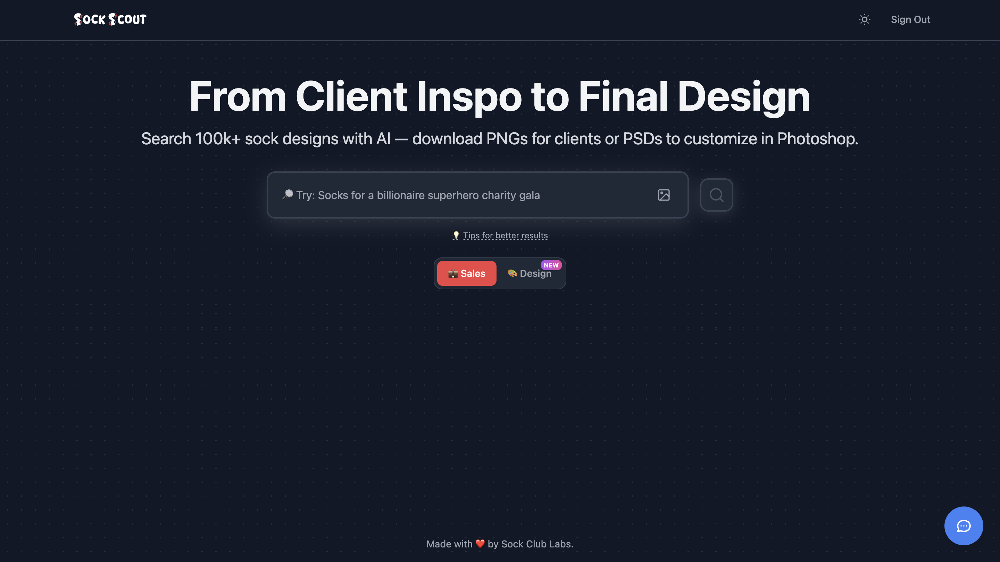
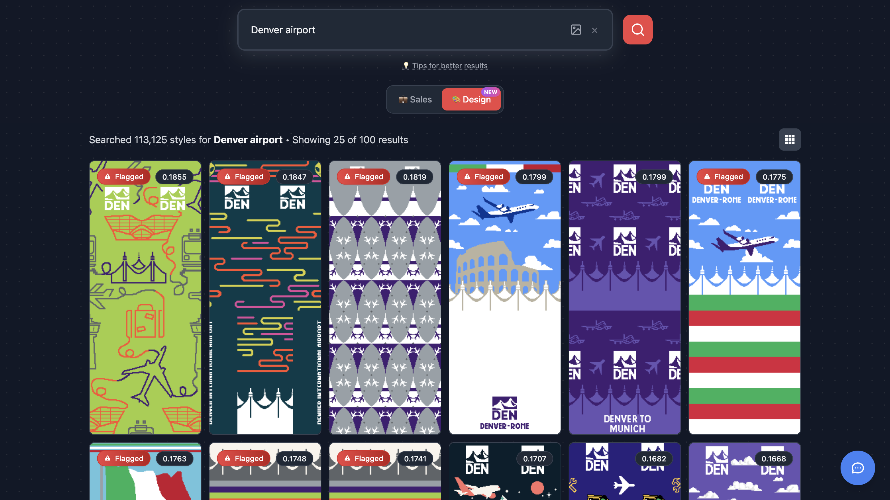
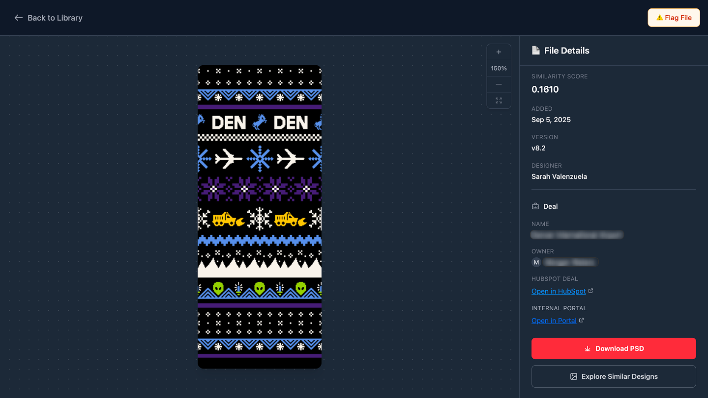
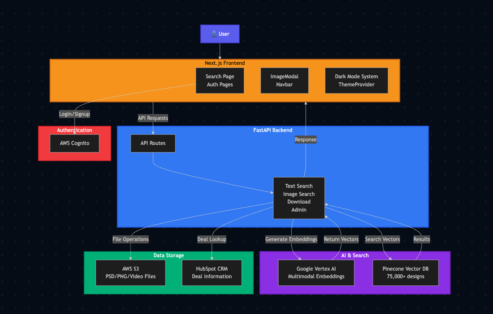

# Sock Scout

An internal semantic visual search tool that helps Sock Club’s design and sales teams find relevant work across a creative archive of 100k+ assets.

## Metadata

| Field | Value |
| --- | --- |
| Documentation status | Documentation draft |
| Project status | Live and part of the daily internal team workflow |
| My role | Defined requirements with designers and sales; built the search system and asset flagging workflow |
| Timeline | Sales feature functionality: 2 weeks. Design feature functionality: 1 month. Both developed part-time. |
| Tools | Next.js / React, TypeScript, FastAPI, Vercel, Vertex AI, Pinecone, AWS S3, AWS Cognito, HubSpot API, PostHog |

This draft is adapted from my [portfolio case study](https://jamesoncodes.github.io/articles/semantic-search-engine.html) and its existing screenshots. It documents the published account, rather than an inspection of the underlying application's source or production systems. See [source notes](evaluations/source-notes.md) for provenance and evidence gaps.

## At a glance

- **Problem:** Designers and sales struggled to find legacy work in a large Dropbox archive organized around inconsistent filenames and folders.
- **Solution:** Search by concept, text, image, or client context using multimodal embeddings and a vector index, with access to original assets and CRM context.
- **Outcome:** The portfolio reports organic adoption, 1,000+ searches per week, and roughly 10× faster search. These claims still need dated measurements and supporting exports in this library.

## The problem

- **Users:** Sock Club designers, sales teammates, and new hires looking for past creative work.
- **Previous workflow:** Browse nested Dropbox folders, guess filenames, or ask colleagues who remembered where a file lived.
- **Friction:** Designers recreated hard-to-find assets; sales interrupted designers for examples; new hires relied on tribal knowledge.

Dropbox Dash was evaluated, but the published account says it did not provide the nuanced visual discovery the team needed.

## My contribution

- **Personal responsibilities:** Worked with design and sales to define requirements; built the end-to-end search system, resilient ingestion pipeline, and asset flagging workflow described in the case study.
- **Collaborators:** Designers and sales informed requirements. The article credits Baylor Meche and Rachal Berry for the logo. {{Describe other collaborators and distinguish their implementation responsibilities}}
- **AI assistance:** Used Codex and Claude for AI-assisted development, research, learning, and understanding the technologies and implementation. Vertex AI provides the product’s runtime multimodal embeddings.
- **What I validated:** The article reports ingestion reliability, search performance, and organic adoption. {{Describe my specific validation procedures, acceptance criteria, and test artifacts}}

## The solution

- **Trigger:** A teammate enters a description or client name, uploads an image, or explores designs similar to an existing result.
- **Workflow:** Embed the query, retrieve similar assets, hydrate metadata, and present previews with links to related deals and original files.
- **Output:** Relevant design candidates, downloadable assets, and supporting HubSpot or internal project context.
- **Human judgment:** Teammates choose suitable designs and flag issues such as outdated logos, licensing restrictions, or knittability. A similarity score alone does not establish production suitability.

## Demo

The existing portfolio illustrates this sequence; it has not been rerun during this documentation update.

1. **Input:** Search for `Denver airport`, the example shown in the portfolio.
2. **System behavior:** Return matching designs in a results grid with similarity scores and visible quality flags.
3. **Outcome:** A teammate can inspect a candidate, open its deal or portal context, download the PSD, or explore similar designs. The screenshots show available controls; they do not prove a completed download or timed task.

*Existing portfolio screenshot: search entry point. The original capture's real-versus-synthetic provenance is not documented.*

*Existing portfolio screenshot: illustrative search results. The capture shows 113,125 styles searched; this is a historical UI value, not a newly verified archive count.*

*Sanitized portfolio screenshot: deal name and owner are visibly blurred in the original. No additional changes were made here; capture date and other sanitization details remain undocumented.*

See the [screenshot index](screenshots/README.md) for the flagging view and source files. {{Add a hosted walkthrough link if available}}

## How it works

*Existing architecture illustration. Its index label says 75,000+ designs, while later article text says 100k+ and the results screenshot shows 113,125 styles. These snapshots have not been reconciled into a dated inventory.*

- **Components:** Next.js frontend; FastAPI search backend on Vercel’s serverless Python runtime; Vertex AI embeddings; Pinecone serverless vector index; S3 asset storage; Cognito authentication.
- **Integrations:** Dropbox-to-S3 ingestion, HubSpot deal metadata, and PostHog usage analytics and error tracking.
- **Decision logic:** Text and image queries share an embedding space. The published index uses cosine similarity and 1,408-dimensional vectors, with metadata filtering and hydration.
- **Ingestion:** Convert files to PNG previews, generate embeddings, and upsert vectors with metadata. Check Pinecone before embedding to avoid duplicates.
- **Error handling:** Adjustable batch concurrency, exponential backoff and retries, corrupt-file skipping, blank-PSD handling, and progress tracking support long ingestion runs.
- **Human review:** Designers flag assets using preset reasons; teammates assess the relevance and suitability of retrieved work.
- **Monitoring:** The article names PostHog for analytics and error tracking. {{Add alerting thresholds, ownership, and incident examples}}

The [diagram notes](diagrams/README.md) record the source and snapshot limitations.

## Results and evidence

These are **portfolio-reported results**, not independently verified measurements from raw data in this repository. No before/after study or production export has been imported. See the [evidence register](evaluations/source-notes.md).

| Metric or observation | Before | After | Evidence type | Measurement period | Source |
| --- | --- | --- | --- | --- | --- |
| Search speed | Not recorded | Reported ~10× faster | Reported comparison; method not supplied | Not supplied | [Article](https://jamesoncodes.github.io/articles/semantic-search-engine.html) |
| Internal search activity | Not supplied | Reported 1,000+ searches/week | Reported usage; raw counts not supplied | Weekly unit; exact window not supplied | [Article](https://jamesoncodes.github.io/articles/semantic-search-engine.html) |
| Search latency | Not supplied | Reported 300–600 ms | Reported performance; timing boundary and distribution not supplied | Not supplied | [Article](https://jamesoncodes.github.io/articles/semantic-search-engine.html) |
| Lost-asset time | Not recorded | Reported ~40% reduction | Approximate portfolio claim; measurement versus estimate unspecified | Not supplied | [Portfolio](https://jamesoncodes.github.io/#featured-project) |
| Designer experience | Redundant recreation and interruptions described | Positive feedback and adoption described | Qualitative feedback | Not supplied | [Article](https://jamesoncodes.github.io/articles/semantic-search-engine.html) |

The qualitative account does not establish that duplicate work was eliminated. {{Add dated analytics, before/after task samples, and the method behind each comparison}}

## Decisions and tradeoffs

- **Purpose-built search:** Dropbox Dash did not satisfy the published requirements for conceptual visual discovery. Building a dedicated system meant taking ownership of ingestion, access, and reliability.
- **Shared text/image embeddings:** Vertex AI supports both query types in a shared space. The article cites quality, latency, and cost as selection criteria; benchmark data is not included.
- **Serverless vector search:** Pinecone was chosen for metadata filtering, read performance, upserts, and low operational overhead.
- **Recoverable ingestion:** Batching, duplicate checks, and retries address failures in long processing runs.
- **Workflow integration:** Downloads, CRM links, and flagging connect discovery to the work users need to complete.

{{Add alternatives evaluated, rejected options, and remaining operating tradeoffs}}

## Limitations and lessons

- **Limitations:** This draft is based on published documentation and historical visuals. Search relevance benchmarks, current corpus size, exact measurement windows, and the underlying application source are not available here. Asset quality still requires human judgment.
- **Lessons reported in the article:** UX drives adoption; resilient pipelines matter; useful search can reduce dependence on perfect filenames and metadata; trust in retrieval opens additional workflows.

{{Add concrete failure cases, security and access constraints, and what I would change}}

## Current state and next steps

- **Current state:** The portfolio describes a scaled internal tool that became part of daily work. Its live operating state has not been checked during this update.
- **Documentation next steps:** Confirm build dates, collaborators, development AI assistance, and current maintenance status. Add dated measurement artifacts and a hosted walkthrough; reconcile the corpus counts across source snapshots.
- **Project next steps:** {{Describe actual planned product work; do not treat documentation gaps as a product roadmap}}

## Supporting-material links

- [Screenshots](screenshots/README.md)
- [Diagrams](diagrams/README.md)
- [Evaluations and evidence register](evaluations/README.md)
- [Videos and hosted demos](videos/README.md)
- [Original portfolio case study](https://jamesoncodes.github.io/articles/semantic-search-engine.html)
- **Source repository:** {{Add the application source repository link if shareable; the portfolio repository contains documentation, not the app implementation}}
