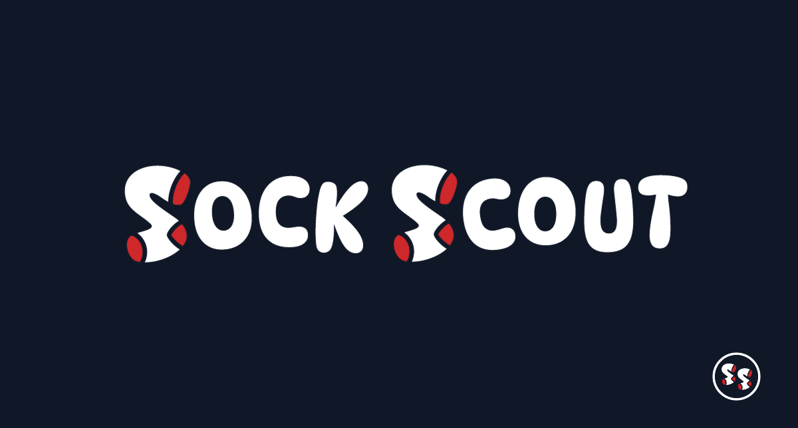

# Sock Scout

An internal semantic visual search tool that helps Sock Club’s design and sales teams find relevant work across a creative archive of 100k+ assets.

## Metadata

| Field | Value |
| --- | --- |
| Documentation status | Documentation draft |
| Project status | Live and part of the daily internal team workflow |
| My role | Defined requirements with designers and sales; built the search system and asset flagging workflow |
| Timeline | Sales feature functionality: 2 weeks. Design feature functionality: 1 month. Both developed part-time. |
| Tools | Next.js / React, TypeScript, FastAPI, Vercel, Vertex AI, Pinecone, AWS S3, AWS Cognito, HubSpot API, PostHog |

See my [portfolio article](https://jamesoncodes.github.io/articles/semantic-search-engine.html) for the original write-up.

## At a glance

- **Problem:** Designers and sales struggled to find legacy work in a large Dropbox archive organized around inconsistent filenames and folders.
- **Solution:** Search by concept, text, image, or client context using multimodal embeddings and a vector index, with access to original assets and CRM context.
- **Outcome:** Organic adoption, 1,000+ internal searches per week, and roughly 10× faster search. Measurement details and available evidence are noted below.

## The problem

- **Users:** Sock Club designers, sales teammates, and new hires looking for past creative work.
- **Previous workflow:** Browse nested Dropbox folders, guess filenames, or ask colleagues who remembered where a file lived.
- **Friction:** Designers recreated hard-to-find assets; sales interrupted designers for examples; new hires relied on tribal knowledge.

We evaluated Dropbox Dash, but it did not provide the nuanced visual discovery the team needed.

## My contribution

- **Personal responsibilities:** Worked with design and sales to define requirements; built the end-to-end search system, resilient ingestion pipeline, and asset flagging workflow.
- **Collaborators:** Designers and sales informed requirements. Baylor Meche and Rachal Berry created the logo.
- **AI assistance:** Used Codex and Claude for AI-assisted development, research, learning, and understanding the technologies and implementation. Vertex AI provides the product’s runtime multimodal embeddings.

## The solution

- **Trigger:** A teammate enters a description or client name, uploads an image, or explores designs similar to an existing result.
- **Workflow:** Embed the query, retrieve similar assets, hydrate metadata, and present previews with links to related deals and original files.
- **Output:** Relevant design candidates, downloadable assets, and supporting HubSpot or internal project context.
- **Human judgment:** Teammates choose suitable designs and flag issues such as outdated logos, licensing restrictions, or knittability. A similarity score alone does not establish production suitability.

## Demo

The screenshots below walk through a search for an existing client's designs.

1. **Input:** Search for `Denver airport`.
2. **System behavior:** Return matching designs in a results grid with similarity scores and visible quality flags.
3. **Outcome:** A teammate can inspect a candidate, open its deal or portal context, download the PSD, or explore similar designs. This walkthrough illustrates the interface rather than a timed task.

*Search entry point. Original screenshot; capture date and real-versus-synthetic provenance are undocumented.*

*Search results for Denver airport. The screenshot shows 113,125 styles searched at the time of capture; it is not a current inventory.*

*Sanitized screenshot: deal name and owner are blurred. Capture date and other sanitization details are undocumented.*

See the [screenshot index](screenshots/README.md) for the flagging view and source files. {{Add a hosted walkthrough link if available}}

## How it works

*Architecture diagram. The 75,000+ index label and the 113,125-style results screenshot represent different snapshots. Their dates need confirmation before comparing them with the 100k+ archive figure.*

- **Components:** Next.js frontend; FastAPI search backend on Vercel’s serverless Python runtime; Vertex AI embeddings; Pinecone serverless vector index; S3 asset storage; Cognito authentication.
- **Integrations:** Dropbox-to-S3 ingestion, HubSpot deal metadata, and PostHog usage analytics and error tracking.
- **Decision logic:** Text and image queries share an embedding space. The index uses cosine similarity and 1,408-dimensional vectors, with metadata filtering and hydration.
- **Ingestion:** Convert files to PNG previews, generate embeddings, and upsert vectors with metadata. Check Pinecone before embedding to avoid duplicates.
- **Error handling:** Adjustable batch concurrency, exponential backoff and retries, corrupt-file skipping, blank-PSD handling, and progress tracking support long ingestion runs.
- **Human review:** Designers flag assets using preset reasons; teammates assess the relevance and suitability of retrieved work.
- **Monitoring:** PostHog provides usage analytics and error tracking. {{Add alerting thresholds, ownership, and incident examples}}

The [diagram notes](diagrams/README.md) record the source and snapshot limitations.

## Results and evidence

The figures below were previously published in my portfolio. Baselines for search speed and lost-asset time were not recorded, and raw measurement data is not included here.

| Metric or observation | Before | After | Evidence type | Measurement period | Source |
| --- | --- | --- | --- | --- | --- |
| Search speed | Not recorded | ~10× faster | Approximate comparison; method not documented | Not supplied | [Article](https://jamesoncodes.github.io/articles/semantic-search-engine.html) |
| Internal search activity | Not supplied | 1,000+ searches/week | Usage figure; raw counts not included | Weekly unit; exact window not supplied | [Article](https://jamesoncodes.github.io/articles/semantic-search-engine.html) |
| Search latency | Not supplied | 300–600 ms | Performance figure; timing boundary and distribution not documented | Not supplied | [Article](https://jamesoncodes.github.io/articles/semantic-search-engine.html) |
| Lost-asset time | Not recorded | ~40% reduction | Approximate reduction; measurement versus estimate unspecified | Not supplied | [Portfolio](https://jamesoncodes.github.io/#featured-project) |
| Designer experience | Redundant recreation and interruptions | Positive feedback and adoption | Qualitative feedback | Not supplied | [Article](https://jamesoncodes.github.io/articles/semantic-search-engine.html) |

Designer feedback supports the usefulness of the tool.

## Decisions and tradeoffs

- **Purpose-built search:** Dropbox Dash did not meet the team's requirements for conceptual visual discovery. Building a dedicated system meant taking ownership of ingestion, access, and reliability.
- **Shared text/image embeddings:** Vertex AI supports both query types in a shared space. I chose it for embedding quality, latency, and cost. The embedding model ranked #1 on MTEB at the time.
- **Serverless vector search:** Pinecone was chosen for metadata filtering, read performance, upserts, and low operational overhead.
- **Recoverable ingestion:** Batching, duplicate checks, and retries address failures in long processing runs.
- **Workflow integration:** Downloads, CRM links, and flagging connect discovery to the work users need to complete.

## Limitations and lessons

- **Limitations:** Search relevance benchmarks, a dated corpus inventory, and exact measurement windows are not documented here. Screenshots show historical interface states. Asset quality still requires human judgment.
- **Lessons:** UX drives adoption; resilient pipelines matter; useful search can reduce dependence on perfect filenames and metadata; trust in retrieval opens additional workflows.

## Supporting-material links

- [Screenshots](screenshots/README.md)
- [Diagrams](diagrams/README.md)
- [Original portfolio case study](https://jamesoncodes.github.io/articles/semantic-search-engine.html)
